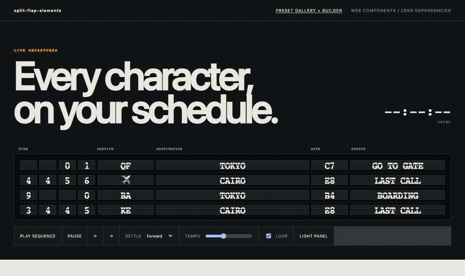

# split-flap-elements

Configurable, accessible split-flap displays built with Web Components. Use letters, numbers, words, symbols, or emoji; schedule the order in which cells settle; and style the board through CSS custom properties and parts.

[](https://github.com/gabeosx/split-flap-elements/actions/workflows/ci.yml)
[](./LICENSE)

[](https://gabeosx.github.io/split-flap-elements/)

**[Open the interactive demo](https://gabeosx.github.io/split-flap-elements/)**

## Install

The first npm release is being prepared. Until it is available, clone the repository and run the demo locally:

```sh
git clone https://github.com/gabeosx/split-flap-elements.git
cd split-flap-elements
npm install
npm run dev
```

After publication:

```sh
npm install split-flap-elements
```

## Quick start

```html
<sfe-board id="board" loop announce>
  <sfe-cell name="gate" preset="alpha" value="A"></sfe-cell>
  <sfe-cell name="status" span="5"></sfe-cell>
</sfe-board>

<script type="module">
  import "split-flap-elements";

  const board = document.querySelector("#board");
  const status = board.querySelector('[name="status"]');
  status.reel = ["ON TIME", "BOARDING", "LAST CALL"];
  status.value = "ON TIME";

  board.sequence = [
    {
      values: { gate: "A", status: "BOARDING" },
      hold: 2400,
      settleOrder: "forward",
      stagger: 90,
    },
    {
      values: { gate: "C", status: "LAST CALL" },
      settleOrder: "center-out",
    },
  ];

  board.play();
</script>
```

Values are plain text. A requested value must exist in its cell's reel; invalid configuration dispatches `sfe-config-error` instead of silently producing the wrong display.

## Cells

`<sfe-cell>` can use a built-in preset or any non-empty array of strings.

```js
const cell = document.querySelector("sfe-cell");

cell.reel = ["READY", "BOARDING", "DEPARTED", "✓"];
cell.value = "READY";
cell.flipDuration = 120;
cell.spinDuration = 900;
cell.intermediateOrder = "random";

await cell.spinTo("BOARDING");
```

Available presets are `alpha`, `numeric`, `alphanumeric`, and `symbols`. HTML-authored custom reels may use a JSON array:

```html
<sfe-cell reel='["SUNNY","RAIN","☂"]' value="SUNNY" span="4"></sfe-cell>
```

## Sequences

Each frame has a `values` record keyed by cell `name`. Frames can also set `hold`, `stagger`, `settleOrder`, and timing for every cell or individual named cells.

```js
board.sequence = [
  {
    values: { hour: "1", minute: "4", status: "ON TIME" },
    hold: 1800,
    stagger: 60,
    settleOrder: [[0, 1], 2],
    timing: {
      status: { spinDuration: 1200, intermediateOrder: "reverse" },
    },
  },
];
```

Settle orders:

- `forward`
- `reverse`
- `simultaneous`
- `center-out`
- `edges-in`
- A custom array of cell indexes. Nested arrays settle as one group; omitted cells are appended in document order.

Playback methods are `play()`, `pause()`, `resume()`, `stop()`, `replay()`, `next()`, `previous()`, and `seek(index)`.

## Events

All events bubble across the shadow boundary and include relevant state in `event.detail`.

| Event                | When it fires                                 |
| -------------------- | --------------------------------------------- |
| `sfe-flip-start`     | A cell begins moving toward a target          |
| `sfe-flip`           | A cell shows an intermediate value            |
| `sfe-settle`         | A cell reaches its requested value            |
| `sfe-frame-start`    | A frame starts                                |
| `sfe-frame-settle`   | Every requested cell in a frame has settled   |
| `sfe-sequence-start` | Playback starts                               |
| `sfe-sequence-end`   | Non-looping playback finishes                 |
| `sfe-playback-state` | Playback state changes                        |
| `sfe-config-error`   | A reel, target, frame, or sequence is invalid |

The package intentionally leaves sound to the application. Attach it to events without coupling audio policy to the visual component:

```js
board.addEventListener("sfe-flip", () => audio.play());
```

## Styling

The elements use Shadow DOM, CSS custom properties, and `::part()`.

```css
sfe-board {
  --sfe-board-background: #0b0c0d;
  --sfe-board-padding: 1rem;
  --sfe-board-gap: 0.2rem;
  --sfe-cell-background: #1b1d1f;
  --sfe-cell-color: #f5f1e8;
  --sfe-cell-width: 2em;
  --sfe-cell-height: 2.7em;
  --sfe-font-family: ui-monospace, monospace;
}

sfe-cell::part(split-line) {
  opacity: 0.65;
}
```

Parts include `board`, `grid`, `cell`, `top`, `bottom`, `moving-top`, `moving-bottom`, and `split-line`.

## Accessibility

- Motion is removed when the user requests reduced motion.
- Intermediate values are visual only and are not announced.
- Add the `announce` attribute to a board to announce each settled frame through a polite live region.
- Demo controls have keyboard focus styles and native labels.

## Browser support

The test matrix covers current Chromium, Firefox, and WebKit. The package requires Custom Elements, Shadow DOM, CSS custom properties, private class fields, and ES modules.

## Development

```sh
npm install
npm run dev
npm run validate
```

See [CONTRIBUTING.md](./CONTRIBUTING.md) for the contribution and release conventions.

## License

[MIT](./LICENSE) © Gabe Albert
